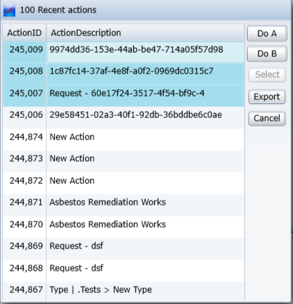
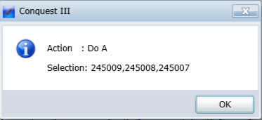

# DataGridSelectorDialog

> This is available in Conquest III 3.0330 or later.

For displaying and selecting items returned from a query.

Example: [DataGridSelectorDialog.py](DataGridSelectorDialog.py)

The example will display the following dialog:

After some items are selected in the dialog, the following message will be displayed:

